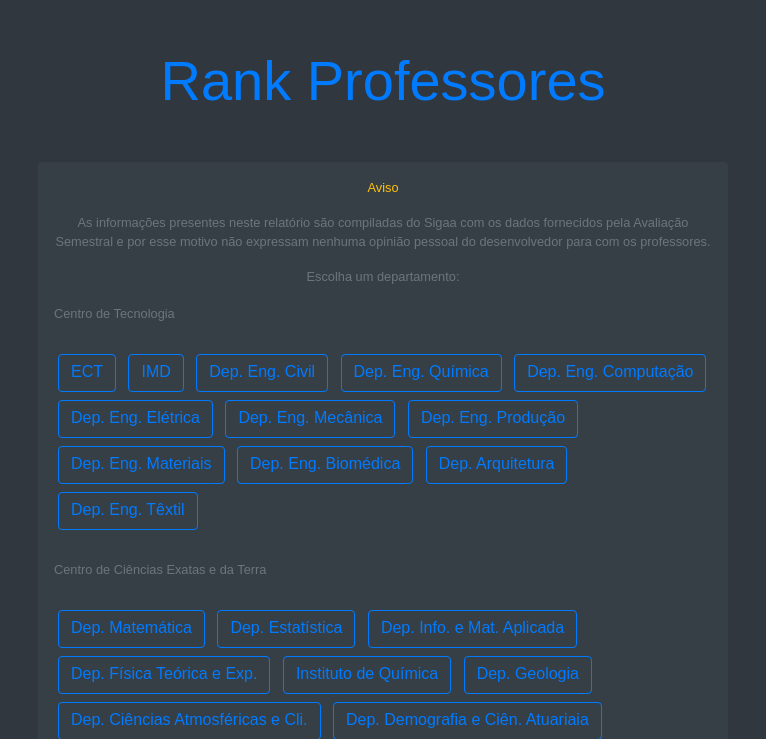
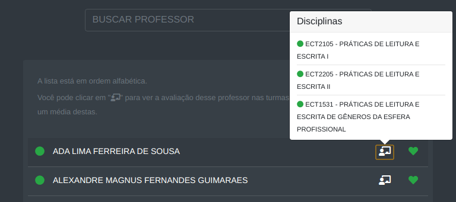

## Avaliação Semestral Compilada UFRN

<!-- # [Link para a página](https://juniordnts.github.io/professor-rank/front/index.html) -->

#### As informações presentes neste relatório são compiladas do Sigaa com os dados fornecidos pela Avaliação Semestral e por esse motivo não expressam nenhuma opinião pessoal do desenvolvedor para com os professores.

<!-- ## Screenshot: -->

<!-- _Página principal, escolha o departamento_

---

_Departamento, clique nos ícones para as informações_

---

_Ícone da bolinha, mostra a média das notas e a média do desvio padrão da avaliação do professor_

---

_Ícone do quadro, mostra a indicação de cada professor por disciplinas_

 -->
